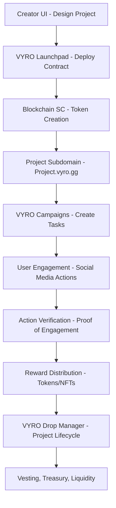

**VYRO** is a comprehensive no-code platform that democratizes the creation and growth of memecoins and NFT projects on the Xion Blockchain. By combining intuitive design tools, viral engagement mechanics, and robust launch infrastructure, VYRO eliminates technical barriers while enabling creators to build, monetize, and scale digital assets with minimal friction.

|  |  |  |
|---|---|---|

## Features

### VYRO Launchpad
- Intuitive drag-and-drop page builder for custom landing pages
- Professional design templates optimized for conversion and virality
- Subdomain hosting with premium custom domain options
- Responsive design for all devices

### VYRO Campaigns
- Action verification system for community participation
- Automated reward distribution for verified social activities
- Real-time leaderboards that gamify participation
- Comprehensive analytics on campaign performance

### VYRO Drop Manager
- Professional tools to manage the complete project lifecycle
- Customizable token distribution with vesting schedules
- Multi-sig controls for enhanced treasury security
- Configurable liquidity management with time-locks
- Token-gating for exclusive content and features

## Technology Stack
- **Blockchain**: Solidity smart contracts deployed on Polygon PoS
- **Storage**: IPFS for decentralized content storage
- **Integration**: RPC providers and wallet connect interfaces
- **Security**: Comprehensive smart contract audits and verification systems

## Competitive Advantage
- **No-Code Philosophy**: True drag-and-drop functionality requiring zero technical knowledge
- **Branded Project Presence**: Professional subdomains with consistent branding
- **Engagement-to-Earn Mechanics**: On-chain proof of social engagement with automated rewards
- **Professional Growth Tools**: Enterprise-grade analytics accessible to all creators
- **Xion-First Approach**: Optimized for no fees and high throughput

## Roadmap

### Phase 1: Foundation (2 months)
- Smart contract development and auditing
- Core launchpad infrastructure development
- Landing page builder MVP
- Initial security framework implementation

### Phase 2: Beta Development (3 months)
- Campaign system with engagement verification
- Creator dashboard and analytics
- Closed beta launch (whitelist-only)
- Feedback integration and iteration

### Phase 3: Public Launch (4 months)
- Full public platform release
- Premium subscription tiers
- Custom domain integration
- Complete Drop Manager suite

### Phase 4: Expansion (3+ months)
- Mobile application development
- Creator staking and reputation system
- Progressive decentralization through DAO formation
- Ecosystem expansion initiatives

## Workflow

## Business Model
- **Subscription Plans**: Free basic tier, Premium and Enterprise
- **Launch Fees**: Tiered pricing based on project scope
- **Transaction Commissions**: Configurable micro-fees (0.5-2%) on token sales and NFT mints
- **Premium Tools**: Add-on pricing for specialized features

## Links
- [Collaborate →](https://discord.com/users/mtcxdev)
- [Inquire →](mailto:toogun@mtcx.dev)

## License
VYRO is licensed under the MIT License. See [LICENSE](LICENSE) for details.

## About the Team
VYRO is led by mtcxdev and operates under MTCX IO MEDIA, a digital development studio specializing in blockchain applications. The team includes smart contract engineers, frontend/backend developers, UX specialists, and community growth strategists.
