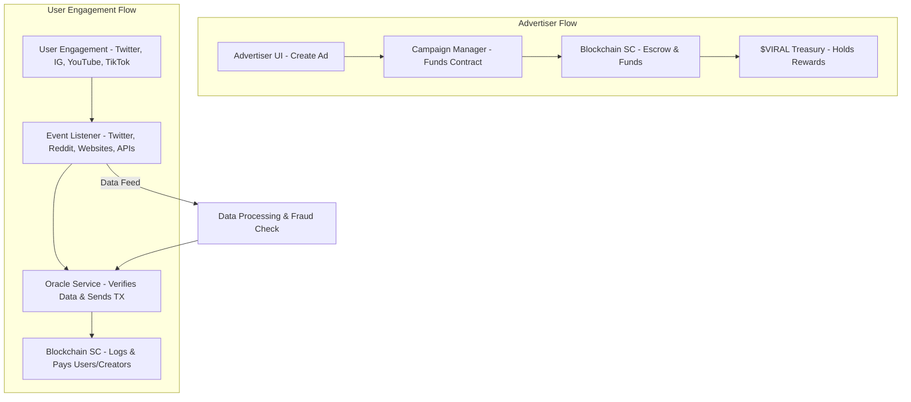

|  | VYRO |
|---|---|

**Vyro** is a decentralized engagement and advertising platform that enables brands, advertisers, and individuals to create incentivized engagement campaigns. Users earn rewards for completing verified tasks, such as social media interactions and content creation.

| )  |   |  |
|---|---|---|

# Features
- **Vyro Engage** – Earn rewards for completing social media tasks.
- **Vyro Ads** – Transparent and efficient advertising for brands.
- **Non-Custodial Wallets** – Users retain full control over their funds.
- **Smart Contract-Based Rewards** – Automated and transparent payouts.
- **On-Chain Verification** – Ensures immutable task completion tracking.

# Roadmap
-  **->** MVP Development & Smart Contract Deployment
-  Frontend & User Dashboard
-  Testnet Launch & Security Audits
-  Mainnet Launch & Marketing Push
-  Ecosystem Expansion & Partnerships

# ⚡ Workflow

# Tokenomics
- **Total Supply:** 1B $VIRAL
- **Rewards Pool:** 40%
- **Marketing & Partnerships:** 20%
- **Development & Team:** 15%
- **Liquidity & Staking:** 15%
- **Reserve & Future Initiatives:** 10%

# Whitepaper
[**Read the Vyro Whitepaper**](https://vyro-xyz.github.io/assets/vyro-whitepaper-and-tokenomics.pdf)

# License
Vyro is licensed under the MIT License. See [LICENSE](LICENSE) for details.
